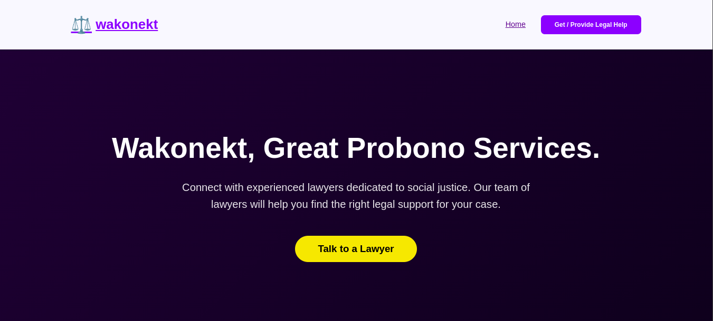
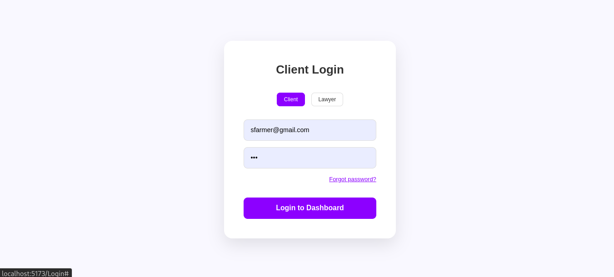
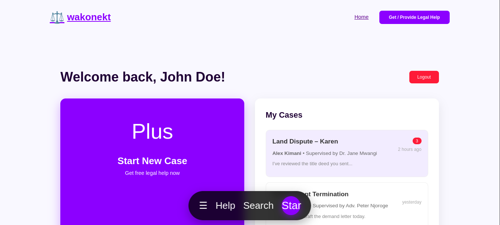

# Wakonekt 
link to power point presentation (slide deck): <a href="https://www.canva.com/design/DAG5VoYCT8A/_RYIzhX4v9o1qcG5iKiqsQ/edit?utm_content=DAG5VoYCT8A&utm_campaign=designshare&utm_medium=link2&utm_source=sharebutton">
click here to access the Wakonekt slide deck </a>

## Home Page


## Login Page


## Client Dashboard

## lawyer dashboard


## Free Pro-Bono Legal Aid Platform
Connecting indigent clients with senior advocates and supervised junior legal assistants.

**SDG 16**: Peace, Justice and Strong Institutions
Wakonekt directly contributes to Target 16.3 – Promote the rule of law at the national and international levels and ensure equal access to justice for all by providing completely free, supervised legal assistance to those who cannot afford it.

## Project Status
**MVP Complete** – Core client flow, authentication, dashboards, case management, and real-time chat are fully functional.

## Quick Start (Local Development)
**Prerequisites**  
    - Node.js ≥ 18  
    - npm or pnpm or yarn
## 1. Clone & Install
 ```
 git clone https://github.com/yourusername/wakonekt.git
cd client
npm install    
 ```
 ## 2. Run the Development Server
 ```
    npm run dev
 ```
 Open http://localhost:5173

## 3. Test Accounts (Mock Login)
- Email: any value
- Password: any value  
    → Choose Client, Junior, or Advocate in the login toggle

# User Guide
## For Clients (People Seeking Free Legal Help)
1. Visit homepage → Click “Get Legal Help”  
2. Log in as Client
3. On dashboard → “Start New Case” → instantly enter live chat
4. Talk to a Junior Legal Assistant (supervised by a Senior Advocate)
5. Return anytime → see all your cases → resume chat

## For Junior Legal Assistants (Law students, pupils, interns)
1. Register → Must request to join a Senior Advocate within 30 days
2. Once accepted → receive client cases
3. Chat directly with clients under supervision
4. Receive feedback (thumbs up, heart, book + comments) from your supervising advocate
## For Senior Advocates (Fully qualified lawyers)
1. Register as Advocate → automatically become a community leader
2. Accept/reject junior join requests
3. Silently monitor live chats
4. Give structured feedback to juniors after each case

## Technical Architecture Overview
